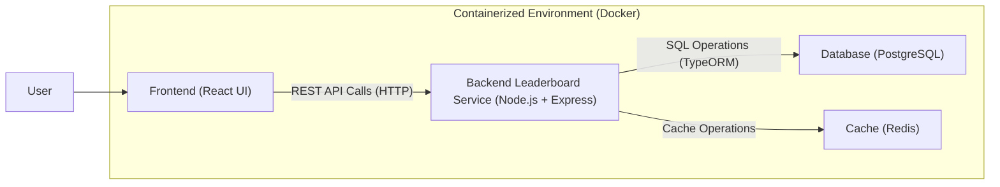

# COMPSCI 426 SCALABLE WEB SYSTEMS

## SPRING 2025

## FINAL PROJECT SUBMISSION

---

# Information

- Name: Ian Rapko
- Email: irapko@umass.edu
- Spire ID: 34235900
- GitHub User ID: 93850661
- Graduation Semester: Spring 2026

---

# Overview

**Team Number:**

- 3

**System Name:**

- U-link

**Project Description:**

- The goal for the app is to create a platform similar to transit that tracks busses in the region, in addition to combining a social media feature to communicate on bus status as well as have a way to 'rank' how far a student has traveled. The app would end up having real-time data for bus time estimates, as well as real time chat for each seperate bus line, with messages being linked to an account for talking.
- In specific, I had worked on the backend of the leaderboard service, which tracks and ranks students based on their public transit usage. The service keeps track of 'points' as a way to rank students for the number of bus rides they take. The system does the following:
  - Real-time point calculation and leaderboard updates
  - API endpoints for the frontend to fetch leaderboard data and update user points
  - Redis caching to optimize frequent leaderboard queries
  - TypeORM integration with PostgreSQL for persistent data storage

---

# Architecture Overview

**Primary Architecture Components:**

- **Frontend (React):** Provides the user interface for the application, including displaying the leaderboard. It communicates with the backend to fetch necessary data.
- **Backend (Node.js + Express):** Currently, this consists of a `leaderboard-service` microservice. It handles API requests related to the leaderboard, processes data, and interacts with the database and cache.
- **Database (PostgreSQL):** Stores persistent data for the leaderboard, such as student information, ride counts, and points. TypeORM is used as the Object-Relational Mapper.
- **Caching (Redis):** Employed by the `leaderboard-service` to cache frequently accessed leaderboard data, enhancing response times and reducing database load.
- **Containerization (Docker):** Both the frontend and the `leaderboard-service` are containerized using Docker, facilitating consistent deployment environments and scalability.

**Communication Between Components:**

- The frontend (React) communicates with the backend `leaderboard-service` (Node.js + Express) primarily via REST APIs over HTTP. For instance, it fetches leaderboard data to display to the user. The Vite proxy configuration indicates API requests are routed to the backend service.

**Data Storage:**

- **PostgreSQL:** Serves as the primary relational database for storing structured data related to the leaderboard, including user scores and relevant details.
- **Redis:** Utilized as an in-memory data store for caching purposes, specifically to speed up the retrieval of leaderboard information.

# Architecture Diagram



---

# Code Demonstration

## Front-End Code

Component of the leaderboard

```typescript
// Leaderboard.tsx
import React, { useState, useEffect } from "react";
import { AddEntryForm } from "./AddEntryForm";

interface Student {
	name: string;
	rides: number;
	points: number;
	rank: number;
}

export default function Leaderboard() {
	const [students, setStudents] = useState<Student[]>([]);
	const [loading, setLoading] = useState(true);

	const load = () => {
		setLoading(true);
		fetch("/api/leaderboard")
			.then((r) => r.json())
			.then(setStudents)
			.finally(() => setLoading(false));
	};

	useEffect(load, []);

	if (loading) {
		return <div className="p-4 text-white/80">Loading leaderboard…</div>;
	}

	return (
		<>
			<AddEntryForm onSuccess={load} />

			<div className="backdrop-blur-md bg-white/10 shadow-2xl rounded-lg overflow-hidden">
				<table className="min-w-full">
					<thead className="bg-white/5">
						<tr>
							{["Rank", "Name", "Total Rides", "Points"].map((h) => (
								<th
									key={h}
									className="px-6 py-4 text-left text-sm font-medium text-white/90 uppercase tracking-wider"
								>
									{h}
								</th>
							))}
						</tr>
					</thead>
					<tbody className="divide-y divide-white/10">
						{students.map((s) => (
							<tr
								key={s.rank}
								className="hover:bg-white/5 transition-colors duration-150"
							>
								<td className="px-6 py-4 whitespace-nowrap">
									<div className="text-sm font-medium text-white/80">
										#{s.rank}
									</div>
								</td>
								<td className="px-6 py-4 whitespace-nowrap">
									<div className="text-sm text-white/80">{s.name}</div>
								</td>
								<td className="px-6 py-4 whitespace-nowrap">
									<div className="text-sm text-white/80">{s.rides}</div>
								</td>
								<td className="px-6 py-4 whitespace-nowrap">
									<div className="text-sm text-white/80">{s.points}</div>
								</td>
							</tr>
						))}
					</tbody>
				</table>
			</div>
		</>
	);
}
```

- **Description:**
  The front-end code shown above is a React component called `Leaderboard` that shows a leaderboard table of student data for how far they have traveled. The component manages state for the list of students and a loading indicator. It fetches leaderboard data from the backend API endpoint when mounted and shows the data in a table that shows each student's rank, name, total rides, and points, designed in Tailwind CSS.

```typescript
// AddEntryForm.tsx
import React, { useState, FormEvent } from "react";

interface EntryForm {
	name: string;
	rides: string;
	points: string;
}

export function AddEntryForm({ onSuccess }: { onSuccess(): void }) {
	const [entry, setEntry] = useState<EntryForm>({
		name: "",
		rides: "",
		points: "",
	});
	const [error, setError] = useState<string>("");

	async function submit(e: FormEvent) {
		e.preventDefault();
		setError("");

		// parse the string inputs into numbers
		const ridesNum = parseInt(entry.rides, 10);
		const pointsNum = parseInt(entry.points, 10);

		// minimal validation
		if (!entry.name.trim() || isNaN(ridesNum) || isNaN(pointsNum)) {
			setError("Please enter a name and valid numbers for rides & points.");
			return;
		}

		try {
			const res = await fetch("/api/leaderboard", {
				method: "POST",
				headers: { "Content-Type": "application/json" },
				body: JSON.stringify({
					name: entry.name.trim(),
					rides: ridesNum,
					points: pointsNum,
				}),
			});
			if (!res.ok) {
				const body = await res.json().catch(() => ({}));
				throw new Error(body.error || res.statusText);
			}
			// clear the form
			setEntry({ name: "", rides: "", points: "" });
			onSuccess();
		} catch (err: unknown) {
			if (err instanceof Error) {
				setError(err.message);
			} else {
				setError("Failed to add entry");
			}
		}
	}

	return (
		<form onSubmit={submit} className="flex gap-2 mb-4 items-center">
			<input
				type="text"
				placeholder="Name"
				value={entry.name}
				onChange={(e) => setEntry((old) => ({ ...old, name: e.target.value }))}
				className="p-2 rounded bg-white/20 text-white placeholder-white/50 border border-white/30 focus:bg-white/30 focus:outline-none transition duration-150"
			/>
			<input
				type="number"
				placeholder="Rides"
				value={entry.rides}
				onChange={(e) => setEntry((old) => ({ ...old, rides: e.target.value }))}
				className="p-2 rounded bg-white/20 text-white placeholder-white/50 border border-white/30 focus:bg-white/30 focus:outline-none transition duration-150"
			/>
			<input
				type="number"
				placeholder="Points"
				value={entry.points}
				onChange={(e) =>
					setEntry((old) => ({ ...old, points: e.target.value }))
				}
				className="p-2 rounded bg-white/20 text-white placeholder-white/50 border border-white/30 focus:bg-white/30 focus:outline-none transition duration-150"
			/>

			<button
				type="submit"
				className="px-4 py-2 bg-blue-600 rounded text-white hover:bg-blue-700"
			>
				Add
			</button>
			{error && <span className="text-red-400 ml-4">{error}</span>}
		</form>
	);
}
```

- **Description:**
  The code shown above is another component called `AddEntryForm` that provides a form interface for adding new entries to a leaderboard, as the current user tracking is not implemented. The form collects three pieces of information: a name (text input), number of rides (numeric input), and points (numeric input). It uses React state management to handle form data and validation. When submitted successfully, the submission makes a POST request to `/api/leaderboard` with the form data, clears the form fields, and calls an `onSuccess` function to refresh the parent component.

## Microservice Code

```typescript
// controller.ts - Main API endpoints for the leaderboard service
import { Router, Request, Response, NextFunction } from "express";
import { Student } from "./entity/Student";
import { AppDataSource } from "./repo";
import { redisClient } from "./index";

export const router = Router();

/**
 * GET /leaderboard
 * - Check Redis cache
 * - Fallback to Postgres + sort + rank
 * - Cache result
 */
router.get(
	"/leaderboard",
	async (_req: Request, res: Response, next: NextFunction): Promise<void> => {
		try {
			const cacheKey = "leaderboard";

			// 1) Try cache
			const cached = await redisClient.get(cacheKey);
			if (cached) {
				res.json(JSON.parse(cached));
				return;
			}

			// 2) Hit Postgres
			const repo = AppDataSource.getRepository(Student);
			const students = await repo.find();

			// 3) Sort & rank
			const sorted = students
				.sort((a, b) => b.points - a.points || b.rides - a.rides)
				.map((s, i) => ({ rank: i + 1, ...s }));

			// 4) Store in Redis
			await redisClient.setEx(
				cacheKey,
				Number(process.env.CACHE_TTL ?? 30),
				JSON.stringify(sorted)
			);

			// 5) Return
			res.json(sorted);
		} catch (err) {
			next(err);
		}
	}
);

/**
 * POST /leaderboard
 * - Validate body
 * - Insert new Student
 * - Clear Redis cache to force refresh
 */
router.post(
	"/leaderboard",
	async (req: Request, res: Response, next: NextFunction): Promise<void> => {
		try {
			const { name, rides, points } = req.body;

			if (!name || typeof rides !== "number" || typeof points !== "number") {
				res.status(400).json({
					error: "Must supply name:string, rides:number, points:number",
				});
				return;
			}

			const repo = AppDataSource.getRepository(Student);
			const student = repo.create({ name, rides, points });
			await repo.save(student);

			// Clear the cached leaderboard
			await redisClient.del("leaderboard");

			res.status(201).json(student);
		} catch (err) {
			next(err);
		}
	}
);
```

```typescript
// repo.ts - Database configuration using TypeORM
import { DataSource } from "typeorm";
import { Student } from "./entity/Student";

export const AppDataSource = new DataSource({
	type: "postgres",
	host: process.env.DB_HOST,
	port: +process.env.DB_PORT!,
	username: process.env.DB_USER,
	password: process.env.DB_PASS,
	database: process.env.DB_NAME,
	entities: [Student],
	synchronize: true,
});
```

```typescript
// index.ts - Main service entry point
import "reflect-metadata";
import express from "express";
import { config } from "dotenv";
import { AppDataSource } from "./repo";
import { createClient } from "redis";
import { router as leaderboardRouter } from "./controller";

config();
const app = express();
app.use(express.json());

export const redisClient = createClient({
	url: `redis://${process.env.REDIS_HOST}:${process.env.REDIS_PORT}`,
});

(async () => {
	try {
		await redisClient.connect();
		await AppDataSource.initialize();
		app.use("/api", leaderboardRouter);
		app.listen(4000, () => {
			console.log("🎉 Leaderboard running on http://localhost:4000");
		});
	} catch (error) {
		console.error(error);
	}
})();
```

- **Description:**
  The backend microservice code makes a leaderboard system. It does the following:

  1. **API Endpoints (`controller.ts`):**

     - GET `/api/leaderboard`: Gets the sorted and ranked list of students
     - POST `/api/leaderboard`: Adds a new student entry to the leaderboard
     - Uses Redis caching for improved performance
     - Handles sorting and ranking of students based on points, calculated by the number of rides they take (even though this is not implemented as the user tracking isn't added)

  2. **Database Configuration (`repo.ts`):**

     - Uses TypeORM for database operations
     - Sets up PostgreSQL connection with environment variables
     - Manages the Student object and table

  3. **Service Setup (`index.ts`):**
     - Creates an Express server and middleware
     - Sets up Redis client for caching
     - Configures API routes and database connection

  The service is able to handle scalability by the following:

  - Redis caching to reduce database load
  - TypeORM for to handle database operations efficiently
  - Includes error handling and input validation to minimize time spent on debugging when errors occur
  - Environment-based configuration so that when needed, we can switch between testing and production environments

---

# Docker Configuration

## Dockerfile

```dockerfile
# Base image
FROM node:18
# Set working directory in container
WORKDIR /app
# Copy package files for dependency installation
COPY package.json package-lock.json ./
# Install dependencies
RUN npm install
# Copy TypeScript config
COPY tsconfig.json ./
# Copy source code
COPY src ./src
# Copy environment variables
COPY .env .env
# Compile TypeScript code into JavaScript
RUN npm run build
# Port 4000 is used by the service
EXPOSE 4000
# Start the application
CMD ["npm","start"]
```

- **Description:**
  This Dockerfile builds the leaderboard service container. Using Node.js 18 as the base image, the build copies over the configuration and source files, installs dependencies using npm install, builds the TypeScript code to JavaScript, and exposes port 4000 for the service. The container then runs the compiled application using npm start when launched.

```dockerfile
# Base image
FROM node:18
# Set working directory in container
WORKDIR /app
# Copy package files for dependency installation
COPY package.json package-lock.json ./
# Install dependencies
RUN npm install
# Copy all source files to container
COPY . .
# Expose port 5173 for development server
EXPOSE 5173
# Start development server
CMD ["npm", "run", "dev"]
```

- **Description:**
  This Dockerfile builds the frontend container, using Node.js 18 as the base image. Setting up the /app directory as the working directory, the build copies over the configuration and source files, installs dependencies using npm install, and exposes port 5173 for the Vite development server. When launched, the container runs the development server using npm run dev to allow for the frontent to be reloaded actively during development.

## docker-compose.yml

```yaml
version: "3.8"
services:
  postgres:
    image: postgres:15
    environment:
      POSTGRES_USER: ulink
      POSTGRES_PASSWORD: secret
      POSTGRES_DB: ulinkdb
    volumes:
      - pgdata:/var/lib/postgresql/data

  redis:
    image: redis:alpine
    ports: ["6379:6379"]

  leaderboard:
    build:
      context: ./backend/leaderboard-service
    ports:
      - "4000:4000"
    env_file:
      - ./backend/leaderboard-service/.env
    depends_on:
      - postgres
      - redis

  frontend:
    build:
      context: ./frontend
    ports:
      - "5173:5173"
    command: npm run dev

  nginx:
    image: nginx:stable-alpine
    ports: ["80:80"]
    volumes:
      - ./nginx/nginx.conf:/etc/nginx/nginx.conf:ro
    depends_on:
      - frontend
      - leaderboard

volumes:
  pgdata:
```

- **Description:**
  The `docker-compose.yml` file defines the services within each container that make up the U-link app (only the leaderboard service is implemented as what I have worked on):
  - PostgreSQL database service for persistent data storage
  - Redis service for caching and publisher to subscriber messaging
  - Leaderboard service built from Node.js backend code
  - Frontend service running a Vite React development server
  - Nginx service that routes incoming HTTP traffic to the appropriate backend services based on URL paths
  The file defines services for the frontend, backend, Redis, and PostgreSQL. It sets up the backend service to depend on Redis and PostgreSQL and makes sure that the components can communicate between each other on their respective ports with the use of the `depends_on` field.

---

# Reflection

**What I Learned:**

- The hardest part of the project was understanding how to connect all of the services into a docker container, and be able to have that container run the services all at once without issue. I have now gotten a basic understanding of this, and am able to successfully create and link docker to my projects on a basic level. I still struggle with backend as a whole relative to frontend purely due to a lack of expereince, but after this project my knowledge in Redis, nginx, and Docker have all increased by several magnitudes as previously I had only heard of them and never tried to implement them. If i had ever created a server I would resort to next.js or a similar alternative to remove the process entirely, but now I believe that doing it this way seperately is not much more difficult and allows for a much higher level of custimoization and specific tooling as its more barebones.

---

**Additional Notes (Optional):**

- I think due to the fact that the project was so scattered (at least on what our goals were initially), it was hard to fully get behind the backend work as I felt that there wasn't a real product I was getting toward (this is an idea issue not an assignment design issue). In addition, I had struggled a bit with understanding redis and nginx which was able to be solved eventually by working through the kinks. Again, not a jab at the course, more just a comment on what I found was hardest to grasp.
