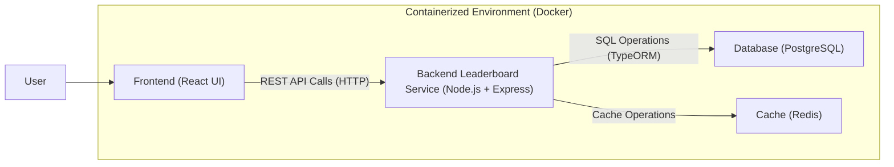

# COMPSCI 426 SCALABLE WEB SYSTEMS

## SPRING 2025

## FINAL PROJECT SUBMISSION

---

# Information

- Name: Ian Rapko
- Email: irapko@umass.edu
- Spire ID: 34235900
- GitHub User ID: 93850661
- Graduation Semester: Spring 2026

---

# Overview

**Team Number:**

- 3

**System Name:**

- U-link

**Project Description:**

- The goal for the app is to create a platform similar to transit that tracks busses in the region, in addition to combining a social media feature to communicate on bus status as well as have a way to 'rank' how far a student has traveled. The app would end up having real-time data for bus time estimates, as well as real time chat for each seperate bus line, with messages being linked to an account for talking.

---

# Architecture Overview

**Primary Architecture Components:**

- **Frontend (React):** Provides the user interface for the application, including displaying the leaderboard. It communicates with the backend to fetch necessary data.
- **Backend (Node.js + Express):** Currently, this consists of a `leaderboard-service` microservice. It handles API requests related to the leaderboard, processes data, and interacts with the database and cache.
- **Database (PostgreSQL):** Stores persistent data for the leaderboard, such as student information, ride counts, and points. TypeORM is used as the Object-Relational Mapper.
- **Caching (Redis):** Employed by the `leaderboard-service` to cache frequently accessed leaderboard data, enhancing response times and reducing database load.
- **Containerization (Docker):** Both the frontend and the `leaderboard-service` are containerized using Docker, facilitating consistent deployment environments and scalability.

**Communication Between Components:**

- The frontend (React) communicates with the backend `leaderboard-service` (Node.js + Express) primarily via REST APIs over HTTP. For instance, it fetches leaderboard data to display to the user. The Vite proxy configuration indicates API requests are routed to the backend service.

**Data Storage:**

- **PostgreSQL:** Serves as the primary relational database for storing structured data related to the leaderboard, including user scores and relevant details.
- **Redis:** Utilized as an in-memory data store for caching purposes, specifically to speed up the retrieval of leaderboard information.

# Architecture Diagram



---

# Code Demonstration

## Front-End Code

```javascript
// TODO: Provide the front-end code you worked on here
// Ensure that the code is properly formatted and includes comments to explain key sections

// Example:
function fetchData() {
	// Fetch data from backend API
	fetch("http://localhost:3000/data")
		.then((response) => response.json())
		.then((data) => console.log(data))
		.catch((error) => console.error("Error:", error));
}
```

- **Description:**
  <TODO: Provide a brief description of the front-end code and its functionality.>

## Microservice Code

```typescript
// TODO: Provide the microservice code you worked on here
// Ensure that the code is properly formatted and includes comments to explain key sections

// Example:
import express from "express";

const app = express();

// API endpoint to get all items
app.get("/items", (req, res) => {
	// Fetch and return items from database
	res.json(items);
});

app.listen(3000, () => {
	console.log("Server running on port 3000");
});
```

- **Description:**
  <TODO: Provide a brief description of the microservice code and its functionality.>

---

# Docker Configuration

## Dockerfile

```dockerfile
# TODO: Provide the Dockerfile you created
# Ensure that it is correctly formatted and includes comments to explain key sections

# Example:
FROM node:14

# Set the working directory
WORKDIR /app

# Copy the package.json and install dependencies
COPY package.json ./
RUN npm install

# Copy the rest of the application code
COPY . .

# Expose port for the app to run
EXPOSE 3000

# Command to start the application
CMD ["npm", "start"]
```

- **Description:**
  <TODO: Provide a brief description of the Dockerfile and what each section does.>

## docker-compose.yml

```yaml
# TODO: Provide the docker-compose.yml file you created
# Ensure that it is correctly formatted and includes comments to explain key sections

# Example:
version: "3.8"

services:
  frontend:
    build:
      context: ./frontend
    ports:
      - "8080:8080"
  backend:
    build:
      context: ./backend
    ports:
      - "3000:3000"
    depends_on:
      - database
  database:
    image: postgres:13
    environment:
      POSTGRES_USER: user
      POSTGRES_PASSWORD: password
```

- **Description:**
  <TODO: Provide a brief description of the `docker-compose.yml` file and how
  the services are set up.>

---

# Reflection

**What I Learned:**

- <TODO: Reflect on the key learnings you gained during the project and class.
  What concepts were most challenging? What skills did you improve on? How did
  the project help you understand scalable web systems better?>

---

**Additional Notes (Optional):**

- <TODO: Any other thoughts or reflections you would like to include.>
